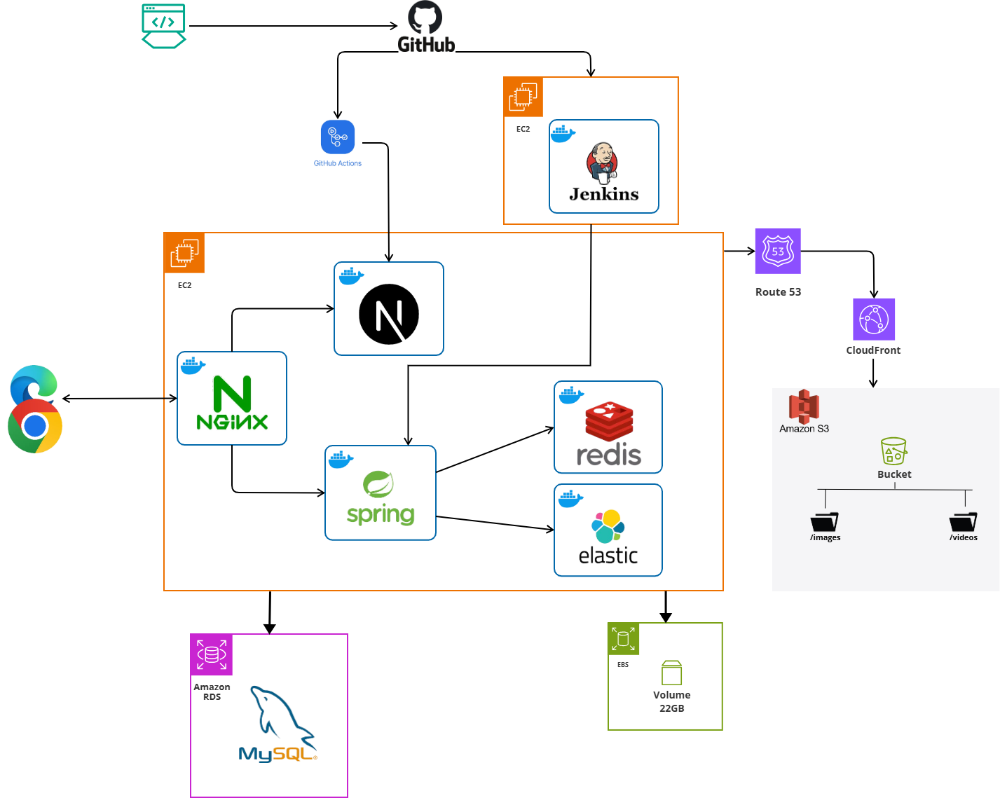

# 운동 루틴 관리 서비스

커밋바디는 사용자가 자신만의 운동 루틴을 설정하고, 운동 기록을 체계적으로 관리할 수 있도록 돕는 서비스입니다.
 
 
📅🏋️‍♂️ 이 플랫폼은 개인의 운동 성과를 쉽게 기록하고 추적할 수 있게 해주며, 사용자는 자신의 목표에 맞춰 루틴을 조정하고 진전을 확인할 수 있습니다.
 
 📊💪 또한, 운동 성과를 다른 사람들과 공유하여 피드백을 받을 수 있으며, 다양한 운동 팁과 동기 부여를 제공하는 커뮤니티와 소통할 수 있는 공간을 제공합니다.

  🤝💬 이렇게 커밋바디는 운동을 지속적으로 이어갈 수 있는 동기를 부여하고, 서로의 경험을 통해 성장을 돕는 소중한 커뮤니티의 역할을 합니다. 🌟

---

## 📐 피그마

[🔗 프로젝트 디자인 보러가기](https://www.figma.com/design/qSh4lgZYEaqPOsQ7V2TMnn/%EC%BB%A4%EB%B0%8B%EB%B0%94%EB%94%94_?node-id=0-1&p=f&t=PRatuH5an4b0GPHh-0)

## 🌏 구현기능

[🌈 스웨거 보러가기](https://www.commitbody.p-e.kr/api/v1/swagger-ui/index.html#/)

---

## 🔧 기술스택

- **Frontend**: NextJs, Tanstack-Query, Zustand, Tailwinds, ShadnUI, PWA, Docker, Github Actions
- **Backend**: Node.js, Express, MongoDB # 채워주세요
- **DevOps**: Docker, AWS, CI/CD # 채워주세요

---

## 🏗️ 아키텍처

## ☄️ 트러블 슈팅

#### 이승환

- [프론트엔드가 알아야 할 리액트 쿼리로 캐싱하기](https://velog.io/@seunghwan7305/%ED%94%84%EB%A1%A0%ED%8A%B8%EC%97%94%EB%93%9C%EA%B0%80-%EC%95%8C%EC%95%84%EC%95%BC-%ED%95%A0-%EB%A6%AC%EC%95%A1%ED%8A%B8-%EC%BF%BC%EB%A6%AC%EB%A1%9C-%EC%BA%90%EC%8B%B1%ED%95%98%EA%B8%B0)

- [사용자 입력창을 최적화 해보자 (Debounce, Throttling)](https://velog.io/@seunghwan7305/%EC%82%AC%EC%9A%A9%EC%9E%90-%EC%9E%85%EB%A0%A5%EC%B0%BD%EC%9D%84-%EC%B5%9C%EC%A0%81%ED%99%94-%ED%95%B4%EB%B3%B4%EC%9E%90)

## 참여 인원

<table width="1000">
    <thead>
    </thead>
    <tbody>
    <tr>
        <th width="1">Pictures</th>
         <td width="100" align="center">
            
        </td>
        <td width="100" align="center">
            
        </td>
        <td width="100" align="center">
            
        </td>
    </tr>
    <tr>
        <th >Name</th>
        <td width="100" align="center">이승환</td>
        <td width="100" align="center">정현우</td>
        <td width="100" align="center">김민우</td>
    </tr>
    <tr>
        <th>Position</th>
        <td width="150" align="center">
            Frontend 
            DevOps 
        </td>
        <td width="150" align="center">
            Frontend 
        </td>
        <td width="150" align="center">
            Backend 
            DevOps 
        </td>
    </tr>
    <tr>
        <th>GitHub</th>
        <td width="100" align="center">
            
        </td>
        <td width="100" align="center">
            
        </td>
        <td width="100" align="center">
            
        </td>
     </tr>
    </tbody>
</table>
